## Overview

This capstone project documents a penetration testing skills assessment conducted on networks in a `controlled lab environment`. The exercise comprised four challenges: SQL Injection, Web Server Vulnerabilities, SMB Server Vulnerabilities, and PCAP Analysis. The objectives were to identify vulnerabilities, execute exploits, retrieve flag files containing challenge codes, and propose remediation strategies. This README provides a detailed account of the methodology, tools, findings, and lessons learned, serving as a comprehensive report for my learning journey.


### Key Objectives

- Exploit an SQL injection vulnerability on DVWA to retrieve and crack Bob Smith’s credentials, accessing the flag file on Bob’s machine `192.168.0.10`.

- Identify web server directories vulnerable to indexing on `10.5.5.12` and retrieve the 2nd flag

- Scan the `10.5.5.0/24` network for SMB targets, enumerate shares on `192.168.0.10`, and retrieve the 3rd flag file.

- Analyze a PCAP file to extract target information. Check directories for the 4th flag.

- Propose remediation methods for each vulnerability type.


## Table of Contents

- [Methodology](#methodology)

- [Tools Used](#tools-used)

- [Key Findings](#key-findings)

- [Remediation Proposals](#remediation-proposals)

- [Challenges and Lessons Learned](#challenges-and-lessons-learned)


## Methodology

The project was executed in a controlled lab environment using a Kali Linux virtual machine customized for ethical hacking. Below is a detailed breakdown of each challenge.


### Challenge 1: SQL Injection (25 Points)

- **Objective**: Retrieve Bob Smith’s account credentials, crack the password, access a flag file at `192.168.0.10`, and propose SQL injection remediation.

- **Detailed Steps**:

  1. **Preliminary Setup**:

     <p align="center">

  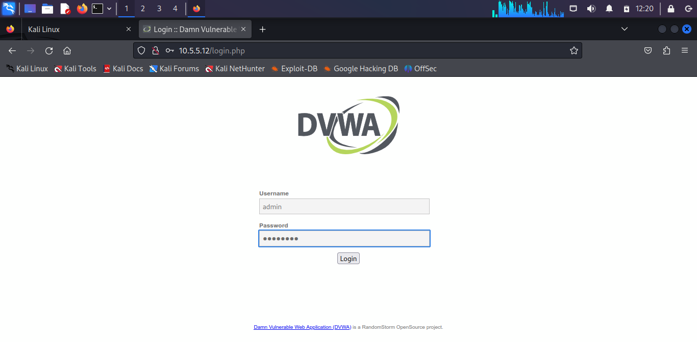

     </p>
     - Navigated to `http://10.5.5.12` using Firefox on Kali Linux.

     - Logged into DVWA with credentials `admin/password`.

     - Accessed the DVWA Security page, set the security level to `Low`, and submitted the change.

     - Verified the security level update in the DVWA interface.


  3. **Confirming SQL Injection Vulnerability**:

     - Navigated to the SQL Injection module at `http://10.5.5.12/vulnerabilities/sqli/`.

     - Entered the payload `' OR 1=1 #` in the User ID field and clicked Submit.

     - Observed the output displaying all user records:


       <p align="center">

  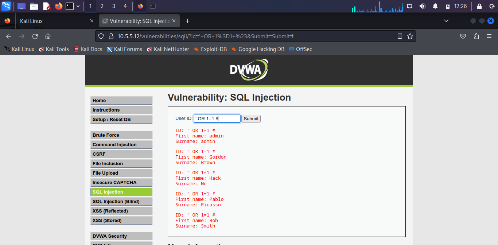

  </p>


     - **Explanation**: The payload `' OR 1=1 #` appends an always-true condition, bypassing the ID check, and `#` comments out trailing query parts, returning all `users` table records.


     


  3. **Determining Number of Fields**:

     - I entered `1' ORDER BY 1 #`, `1' ORDER BY 2 #`, and `1' ORDER BY 3 #` in the User ID field.

     - The first two returned normal responses; the third returned an error: `Unknown column '3' in 'order clause'`.

     - **Explanation**: The `ORDER BY` tests revealed the query involves two fields.

       


  4. **Checking DBMS Version**:

     - Entered `1' OR 1=1 UNION SELECT 1, VERSION()#` and observed:


       <p align="center">

  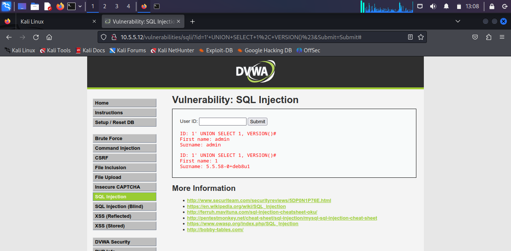

  </p>


     - **Explanation**: The `output` indicates that the DBMS is MySQL version 5.5.58 running on Debian.


  5. **Determining Database Name**:

     - I entered `1' OR 1=1 UNION SELECT 1, DATABASE()#` and observed:


       <p align="center">

  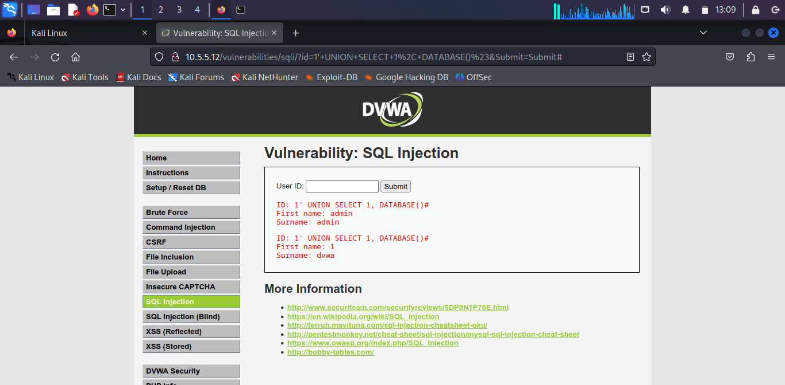

  </p>


     - **Explanation**: The `DATABASE()` function identified the database as `dvwa`.


  6. **Retrieving Table Names**:

     - I entered `1' OR 1=1 UNION SELECT 1, table_name FROM information_schema.tables WHERE table_type='base table' AND table_schema='dvwa'#`.

     - Observed:


       <p align="center">

  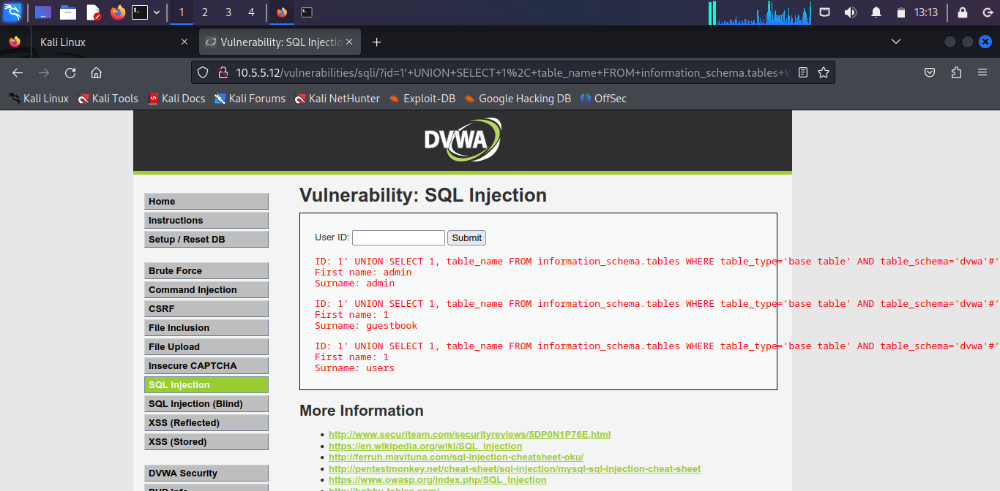

  </p>


     - **Findings**: Identified `guestbook` and `users` tables; prioritized `users` for credentials.


  7. **Retrieving Column Names**:

     - I entered `1' OR 1=1 UNION SELECT 1, column_name FROM information_schema.columns WHERE table_name='users'#`.

     - Identified columns: User accounts

     - **Findings**: Focused on `user` and `password` column for credential extraction.
       
     <p align="center"> 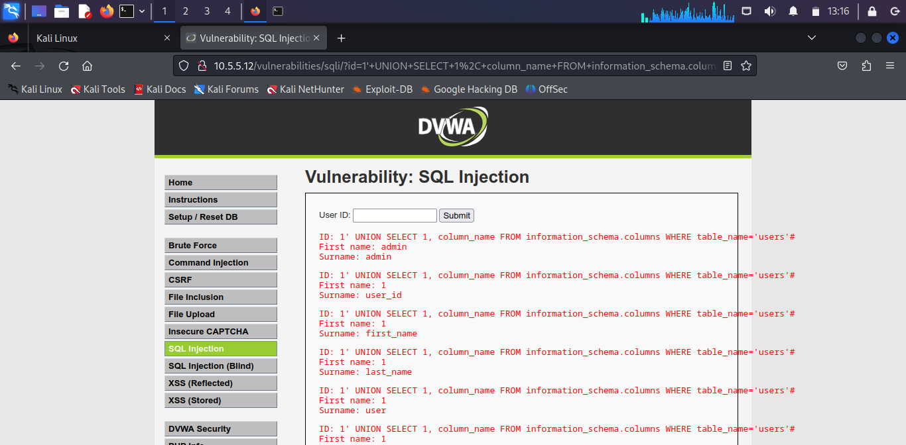 </p>


  8. **Retrieving User Credentials**:

     - I entered `1' OR 1=1 UNION SELECT user, password FROM users #` and observed:
     <p align="center">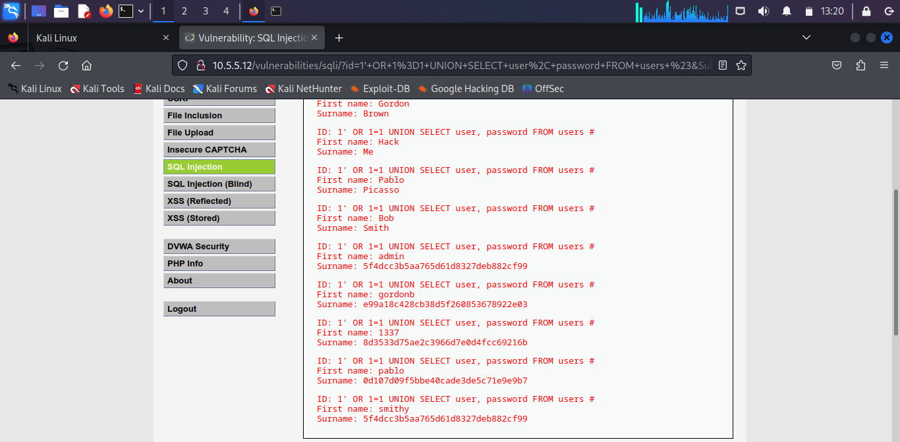 </p>

     - **Findings**: Retrieved Bob Smith’s username (`smithy`) and MD5 hash.


  9. **Cracking Bob Smith’s Password**:

     - I Identified hashes as MD5 (32-character hexadecimal).

     - I navigated to `https://crackstation.net`, pasted Bob Smith’s hash, and clicked “Crack Hashes”.

     - I retrieved the plaintext password as ‘password’

     <p align="center"> 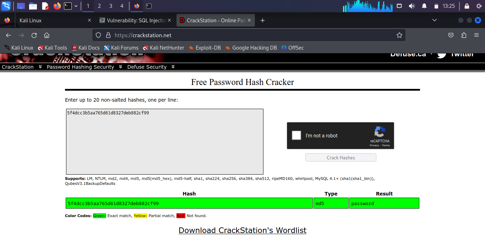 </p>


     - **Cracking Explanation**:

       - CrackStation uses precomputed rainbow tables to match MD5 hashes to common passwords.

       - The instant result indicated a weak password, typical in low-security settings.

       - Verified the password by logging into DVWA with `smithy:<password>`.

       <p align="center"> 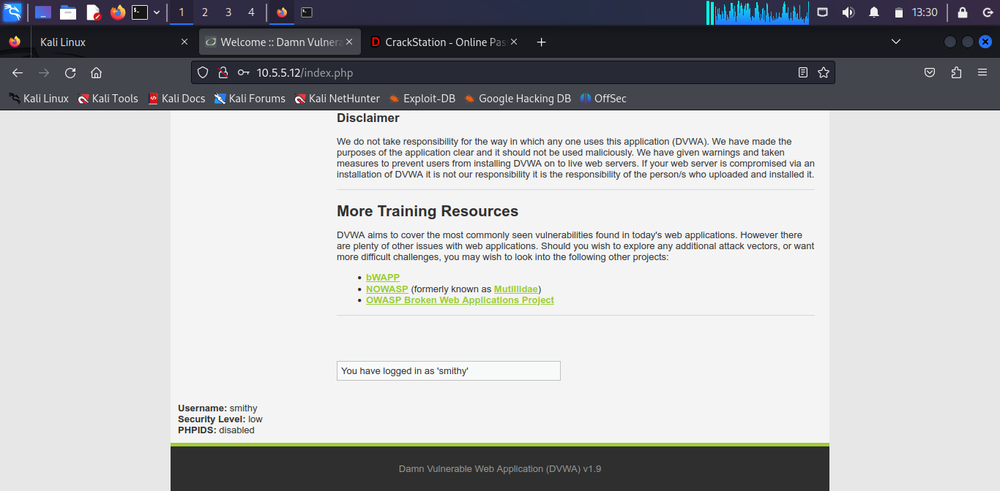 </p>


  10. **Accessing the Challenge File**:

      - Used `smithy:<password>` to SSH into `192.168.0.10`:

        ```bash

        ssh smithy@192.168.0.10

        ```

      - Navigated to `/home/smithy`, located `my_passwords.txt`:

        ```bash

        ls

        my_passwords.txt

        ```

      - I cat the file content and recorded the challenge code.

      <p align="center"> 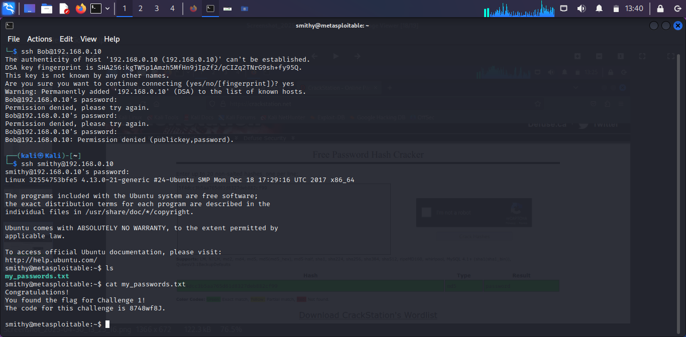 </p>


### Challenge 2: Web Server Vulnerabilities (25 Points)

- **Objective**: Identify directories on `10.5.5.12` with indexing enabled and propose remediation.

- **Steps**:

  1. **Preliminary Setup**:

     - Logged into `http://10.5.5.12` with `admin/password` and set DVWA security to `low`.

  2. **Reconnaissance**:

     - Ran `dirb` to scan directories:

       ```bash

       dirb http://10.5.5.12 -o dirb_output.txt

       ```

     - Identified directories with indexing enabled (`/config/`, `/docs/`, `/external/`) :

     <p align="center"> 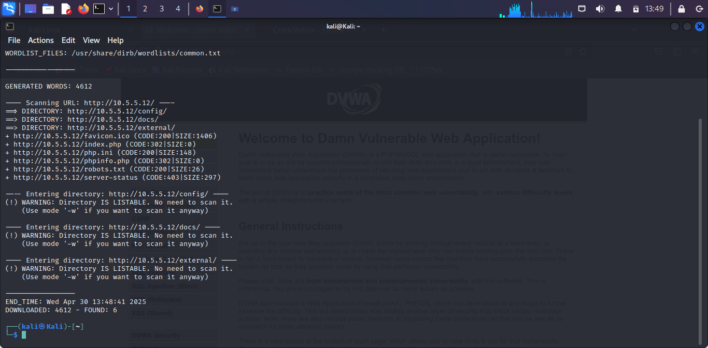 </p>


     - Iccessed all directories in the browser to confirm file listings.

     <p align="center">  </p>


     - The flag file was ‘db_form.html’ found in ‘/config/‘

     <p align="center"> 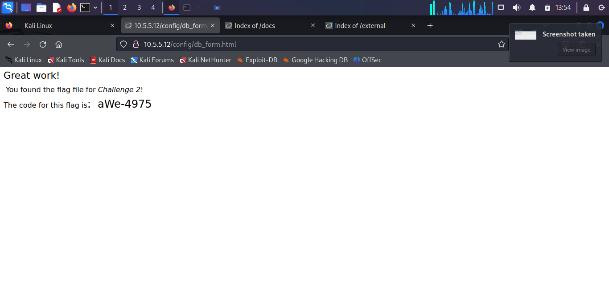 </p>

   


### Challenge 3: Exploit open SMB Server Shares (25 Points)

- **Objective**: Scan the `10.5.5.0/24` network for SMB targets, enumerate shares, retrieve the 3rd flag file, and propose remediation.

- **Detailed Steps**:

  1. **Network Scanning with Nmap**:

     - Scanned the `10.5.5.0/24` network to identify hosts with SMB services (port 139 & 445):


     <p align="center"> 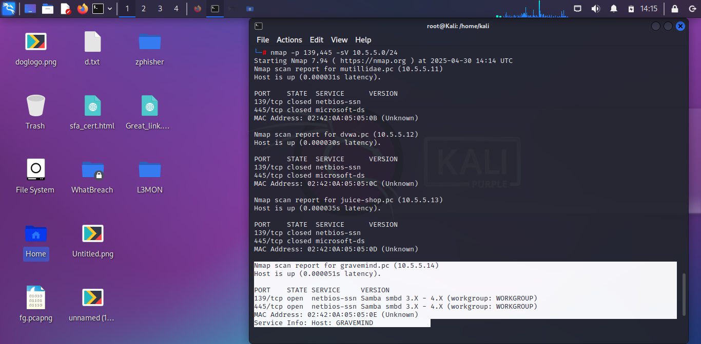 </p>


     - **Explanation**: The `-p 139,445` targets the SMB port, `-sV` finds SMB Service and its version.

     - **Findings**: Identified potential SMB host (`10.5.5.14`) with opened ports 139 and 445 which suggests that the target system is capable of file sharing, potentially exposing it to various vulnerabilities.


  2. **SMB Enumeration with enum4linux**:

     - I utilized `enum4linux` which is `an information gathering tool` in enumerating shares on the target machine. `10.5.5.14`:

     <p align="center">  </p>


     - **Explanation**: The `-S` option performs share listings.

     - **Findings**: Identified four shares of which `workfiles` and `print$` were accessible without a valid user login.

  3. **Accessing Shares with smbclient**:

     - Listed shares on `target`:

       ```bash

       smbclient -L //10.5.5.14

       ```

     - **Findings**: Confirmed the `print$` share was accessible without credentials.

     - Connected to the `print$` share:

       ```bash

       smbclient //10.5.5.14/print$/OTHER

       ```

     - Listed files and downloaded `sxij42.txt`:

       ```bash

       ls

       get sxij42.txt

       ```

     - Viewed the file locally:

       ```bash

       cat sxij42.txt

       ```

     - **Explanation**: The anonymous access indicated a misconfiguration, allowing retrieval of the 3rd challenge code.

     <p align="center">  </p>

      


  4. **Remediation Research**:

     - I proposed methods to secure SMB services.


### Challenge 4: PCAP File Analysis (25 Points)

- **Objective**: Analyze `SA.pcap` to identify the target IP, directories, 4th challenge code, and propose remediation.

- **Steps**:

  1. **PCAP Analysis**:

     - Opened `SA.pcap` in Wireshark:

       ```bash

       wireshark /home/kali/Downloads/SA.pcap &

       ```

     - Applied an HTTP filter:

       ```

       http

       ```

     - Identified the target IP (`10.5.5.11`) and other URLs from which the  URL (`http://10.5.5.11/data`) contained the challenge file when checked.

  2. **Directory Investigation**:

     - Visited the URL in the browser to retrieve the Challenge 4 code.

     - Explored two files it contained to realize `/user_accounts.xlm/`) contained the 4th challenge code.

  3. **Remediation Research**:

     - I proposed methods to prevent clear-text transmission and unauthorized access.

     


## Tools Used

- **Firefox**: Interacted with DVWA and CrackStation.

- **CrackStation**: Cracked MD5 password hashes.

- **Nmap**: Scanned for SMB targets.

- **enum4linux**: Enumerated SMB server details.

- **smbclient**: Accessed SMB shares.

- **Dirb**: Scanned web directories.

- **Wireshark**: Analyzed PCAP file.

- **SSH**: Accessed remote systems.

- **Kali Linux**: Cisco Ethical Hacker customized lab environment.


## Key Findings

- **Challenge 1**: Retrieved Bob Smith’s credentials (`smithy:<password>`), accessed `my_passwords.txt` on `192.168.0.10` for the flag.

- **Challenge 2**: Identified directories on `10.5.5.12` with indexing enabled to find the flag.

- **Challenge 3**: Scanned `10.5.5.0/24`, enumerated the `print$` share on `192.168.0.10`, and retrieved `sxij42.txt`.

- **Challenge 4**: Extracted the target IP (`10.5.5.11`) and http get request URL from `SA.pcap`, retrieving the Challenge 4 code.

- **Overall**: This challenge demonstrated the impact of misconfigurations and the need for robust security.


## Remediation Proposals

- **SQL Injection (Challenge 1)**:

  1. Filter inputs to reject malicious SQL code.

  2. Use prepared statements to sanitize inputs.

  3. Apply least privilege to database accounts.

  4. Keep databases patched and updated.

  5. Deploy a WAF to block SQL injection attempts.


- **Web Server Vulnerabilities (Challenge 2)**:

  1. Disable directory indexing.

  2. Restrict sensitive directories with authentication.


- **SMB Server Vulnerabilities (Challenge 3)**:

  1. Disable SMBv1 and enforce SMBv3 with encryption.

  2. Require strong authentication, disable anonymous access.


- **Clear-Text Transmission and Unauthorized Access (Challenge 4)**:

  1. Enforce HTTPS with TLS 1.3.

  2. Use secure protocols like SFTP.

  3. Implement RBAC for file access: Give access to files based on a user’s role, not just their individual identity.

  4. Audit file permissions regularly.


## Challenges and Lessons Learned

- **SQL Injection**: I could have used sqlmap for automation but crafting manual payloads required that I had schema understanding; manual exploitation enhanced my query knowledge.

- **SMB Enumeration**: Scanning `10.5.5.0/24` revealed multiple potential targets; enum4linux provided critical share details.

- **Password Cracking**: CrackStation’s speed highlighted weak password risks.

- **PCAP Analysis**: Filtering HTTP packets improved efficiency :)

- **Overall**: Manual techniques and documentation deepened my cybersecurity expertise of which I’m very happy about.
